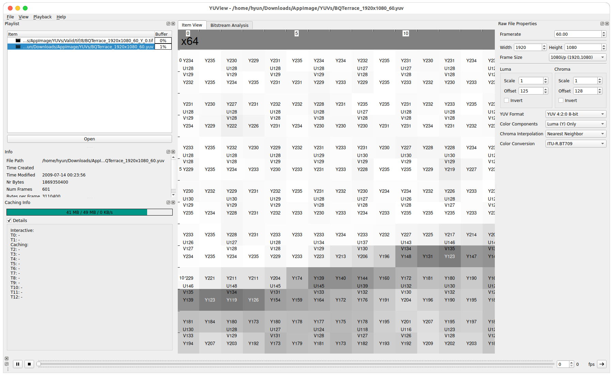

# YUV2PNG - Python Implementation
YUV2PNG makes each .yuv sequence into .png/.tiff format, which consists of y000.png, u000.png and v000.png.  

- PNG -> Make an image as grayscale **RGB** format.  
- TIFF > Make an image as **YUV** format.  

## Execution Result (TIFF format, viewer: [YUView](https://github.com/ient/yuview))
**Original YUV**  
  

**TIFF Y component image**  

## Environment 
> python3

## How to execute
> 1. After downloading the cloned zip file, save it in the local folder.
> 2. After moving into cloned directory, put the .yuv file in YUV420_X/`your_yuv_name.yuv`.  
> 3. Exeucute  

- When execute, you can simply run demo.sh file.  
- Or, run as below command  
- python3 yuv2png.py `YUV_root_path` `IMG_root_path` `Bit depth` `Width` `Height` `Format(png/tiff) < should lower case`  
- **More information about execution is in demo.sh file.**  

## Result
- When executed, the corresponding .png/.tiff file is automatically created in `IMG_root`/`your_yuv_name`/ directory.  

**Warning**
> When you execute the .sh file, you should match your yuv's **width and height**.  
